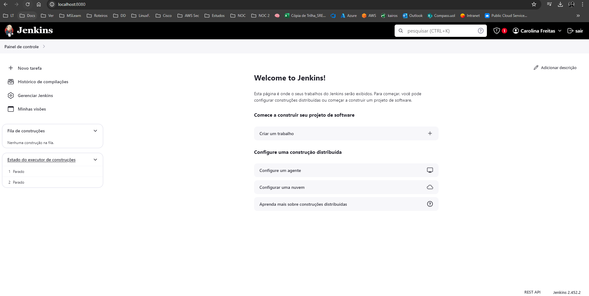

# Jenkins Studies

[Doc. Jenkins](https://www.jenkins.io/doc/tutorials/)   

## Getting started with Jenkins

[Doc.](https://www.jenkins.io/doc/pipeline/tour/getting-started/)

1. Download Jenkins Generic Java package (.war)

2. Open up a terminal in the download directory

3. Run ``java -jar jenkins.war --httpPort=8080``

4. Browse to http://localhost:8080

5. Jenkins GUI after initial installation: 

## Creating your first Pipeline 

[Hello World - Doc.](https://www.jenkins.io/doc/pipeline/tour/hello-world/)

